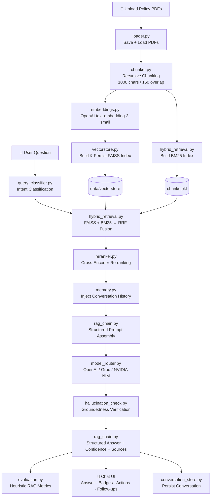

<div align="center">

# 🛡️ Insurance Policy RAG Assistant

**Document-grounded Q&A for Indian health insurance policies — CMCHIS · PM-JAY · ESIC · CGHS · Private Insurers**

Upload policy PDFs and get accurate, citation-backed answers powered by a hybrid retrieval-augmented generation (RAG) pipeline — with confidence scoring, hallucination checks, multi-LLM support, and a full document intelligence & analytics suite.

[](https://www.python.org/)
[](https://streamlit.io/)
[](https://www.langchain.com/)
[](https://github.com/facebookresearch/faiss)
[](#-license)

</div>

---

## 📖 Project Overview

Insurance policy documents are long, dense, and full of clauses that are hard to navigate manually. The **Insurance Policy RAG Assistant** solves this by letting users upload one or more policy PDFs (CMCHIS, PM-JAY, ESIC, CGHS, or private insurer documents) and ask natural-language questions about eligibility, coverage, premiums, waiting periods, claims, and exclusions — with every answer grounded strictly in the uploaded documents.

Rather than a simple "upload → chat" demo, this project is built as a small **enterprise-style RAG platform**: it combines hybrid retrieval (semantic + keyword), cross-encoder re-ranking, conversational memory, groundedness checking, multi-provider LLM routing, and dedicated dashboards for document intelligence and system analytics — all inside a single Streamlit application with no external database.

**Problems it solves:**
- 🔍 Finding specific clauses (eligibility, waiting periods, exclusions) buried inside long PDFs
- 🧾 Comparing two policy documents side-by-side without manual reading
- 🤖 Reducing hallucinated answers by forcing the LLM to answer only from retrieved context, with an automated groundedness check on top
- 🔀 Avoiding vendor lock-in by letting the same pipeline run against OpenAI, Groq, or NVIDIA NIM
- 📊 Giving visibility into retrieval quality, latency, and knowledge base health rather than treating the RAG pipeline as a black box

---

## ✨ Features

### 📥 Document Ingestion
- **PDF Upload** — multi-file upload of insurance policy PDFs via Streamlit's file uploader
- **Document Chunking** — `RecursiveCharacterTextSplitter` (1000-character chunks, 150-character overlap), with per-source chunk indexing for citations
- **Vector Embeddings** — OpenAI `text-embedding-3-small` embeddings for every chunk
- **FAISS Vector Search** — chunks embedded and indexed with FAISS, persisted to disk (`data/vectorstore`) so the knowledge base survives app restarts

### 🔎 Retrieval & Generation
- **Hybrid Retrieval** — FAISS semantic search combined with a BM25 keyword index (`rank-bm25`), fused using **Reciprocal Rank Fusion (RRF)**
- **Cross-Encoder Re-ranking** — `cross-encoder/ms-marco-MiniLM-L-6-v2` (sentence-transformers) re-ranks fused candidates, with an automatic lexical-overlap fallback if the model isn't available, so the app never breaks
- **Multi-Model Support** — pluggable LLM routing across **OpenAI** (`gpt-4o-mini`), **Groq** (`groq/compound-mini`), and **NVIDIA NIM** (`nvidia/nemotron-3-nano-omni-30b-a3b-reasoning`), selectable live from the sidebar
- **Structured RAG Pipeline** — query → intent classification → hybrid retrieval → re-ranking → structured prompt (with conversation history) → LLM → groundedness check → structured, section-labeled answer
- **Retrieval Settings** — adjustable Top-K chunk count via a sidebar slider
- **Streaming Responses** — token-by-token streaming using a background thread + `st.fragment`, with a live **Stop Generating** button
- **Conversational Memory** — recent turns kept verbatim, older turns auto-summarized after a configurable number of turns, so follow-up questions resolve pronouns/context correctly
- **Intent Classification** — keyword-based classifier tagging each question (Eligibility, Benefits, Premium, Waiting Period, Claim Process, Exclusions, etc.)
- **Hallucination / Groundedness Check** — word-overlap heuristic that flags ungrounded sentences in the generated answer
- **Confidence Score** — High / Medium / Low, derived from re-ranking scores of the retrieved context
- **Model Information & Latency** — every answer shows which provider/model produced it, plus separate retrieval and generation latency

### 💬 Chat Interface
- Chat UI with themed glass-card message bubbles and timestamps
- **Confidence, model, and latency badges** under every answer
- **Follow-up question suggestions** — intent-based, templated, clickable chips
- **Like / Dislike / Copy / Regenerate** actions on every assistant response
- **Suggested example questions** shown on a fresh/empty conversation
- **Conversation Management** — create, rename, delete, switch between, and search multiple saved conversations (persisted to `data/conversations.json`)

### 📚 Document Intelligence Dashboard
A dedicated tab with **10 sub-sections**, all operating on the actual chunked/uploaded documents:
- **Explorer** — browse uploaded PDFs with per-document chunk/page/character stats and expandable chunk content
- **Search** — full-text search across all uploaded documents with `<mark>` highlighting
- **Statistics** — total PDFs, pages, chunks, embeddings, average chunk length/tokens, largest/smallest document
- **Policy Summary** — on-demand, one-LLM-call structured summary per document (Coverage, Eligibility, Benefits, Waiting Period, Claims, Exclusions, etc.)
- **Compare** — side-by-side, on-demand LLM comparison of two policy documents rendered as a markdown table
- **Clause Extraction** — on-demand extraction of standard policy clause categories per document
- **Duplicates** — detects duplicate uploaded files (by content hash) and duplicate chunks (by content hash)
- **Coverage Cards** — quick-glance cards reusing previously generated Policy Summaries
- **Source Inspector** — inspect the exact retrieved chunks (with RRF score, rerank score, and final rank) behind any past chat answer
- **KB Health** — a heuristic 0–100 knowledge-base health score based on chunk coverage, hybrid-retrieval status, chunk-size sanity, and duplicate penalty

### 📈 Insights Dashboard
Four sub-tabs, all built from data already collected during normal use:
- **Analytics** — total questions, average confidence/retrieval/generation time, provider usage, intent distribution, and daily usage charts
- **Evaluation** — heuristic RAG evaluation metrics (faithfulness, answer relevance, context precision, context recall, groundedness), with a downloadable evaluation report — explicitly labeled as a word-overlap heuristic, not a RAGAS/LLM-judge score
- **Performance** — average retrieval/generation latency, total session queries, conversation memory turn count
- **Knowledge Base** — PDFs, pages, chunks, embedding count, index size on disk, FAISS/hybrid-search status

### ⚙️ Settings
- Read-only mirror of live sidebar configuration (provider, theme, Top-K, tracing, reranker mode)
- Security configuration display (max upload size, allowed extensions, max files per upload)
- Conversation memory configuration display
- **Developer Options** — optional raw session-state JSON viewer for debugging, plus the on-disk log file path

### 💾 Export
- Export any conversation as **Markdown**, **JSON** (with full per-message metadata: confidence, provider, model, timing, intent, groundedness), or **PDF** (via `fpdf2`)

### 🔒 Security
- Upload validation — file type, per-file size limit, and max files per upload, enforced before processing
- Query sanitization — strips control characters and caps input length
- Safe error handling — user-facing errors never leak stack traces or API keys
- API key masking utility for safe display/logging

### 🪵 Logging & Observability
- Centralized rotating file + console logging (`logs/app.log`) across every module
- Optional **LangSmith tracing** — automatically enabled if `LANGCHAIN_API_KEY` / `LANGSMITH_API_KEY` is set, otherwise a transparent no-op

### 🎨 UI/UX
- Custom "glass-card" themed CSS (`utils/style.css`) with **light/dark mode toggle**
- Tab-based navigation: **Chat**, **Document Intelligence**, **Insights Dashboard**, **Settings**
- Wide layout, custom header banner and footer

### 🧱 Modular Architecture
- Clean separation of concerns: ingestion, retrieval, generation, memory, security, analytics, and UI rendering each live in their own module under `utils/`
- Central `config.py` holds all tunable parameters (chunking, retrieval, memory, security) as typed dataclasses — no scattered magic numbers

---

## 🏗️ Architecture

**End-to-end flow, from PDF upload to answer generation:**



**Pipeline stages, in order:**
1. **Ingestion** — PDFs are saved to `data/uploads`, loaded with `PyPDFLoader`, split into overlapping chunks, embedded with OpenAI embeddings, and indexed in FAISS. A parallel BM25 index is built over the same chunks; both the FAISS index and the raw chunk list are persisted to disk so the knowledge base survives a restart.
2. **Query Understanding** — each question is passed through a keyword-based intent classifier (no extra LLM call).
3. **Hybrid Retrieval** — FAISS semantic search and BM25 keyword search run independently; results are fused with Reciprocal Rank Fusion.
4. **Re-ranking** — the fused candidates are re-ranked by a cross-encoder (or a lexical-overlap fallback), producing the final Top-K context chunks.
5. **Prompt Assembly** — the re-ranked context, conversation memory, and question are merged into a strict, section-labeled system prompt that forbids the model from using outside knowledge.
6. **Generation** — the prompt is sent to the selected provider (OpenAI, Groq, or NVIDIA NIM), either as a blocking call or streamed token-by-token.
7. **Post-processing** — the raw answer is checked for groundedness against the retrieved context, parsed into labeled sections (Answer, Eligibility, Benefits, etc.), assigned a confidence score, and returned with full source/citation metadata.
8. **Logging & Analytics** — every turn is logged, evaluated with heuristic RAG metrics, and appended to the session's query log for the Insights Dashboard.

---

## 📁 Project Structure

```
insurance_rag_assistant/
├── app.py                        # Main Streamlit application (UI, tabs, session state, streaming)
├── config.py                     # Central typed configuration (retrieval, security, memory)
├── requirements.txt              # Python dependencies
├── .env.example                  # Environment variable template
├── .gitignore
├── README.md
│
├── data/
│   ├── uploads/                  # Uploaded PDF files (gitignored, .gitkeep tracked)
│   ├── vectorstore/               # Persisted FAISS index + BM25 chunk cache (gitignored)
│   └── conversations.json        # Persisted multi-conversation store (generated at runtime)
│
├── logs/
│   └── app.log                   # Rotating application log (generated at runtime)
│
└── utils/
    ├── loader.py                  # PDF saving & loading
    ├── chunker.py                 # Document chunking
    ├── embeddings.py              # OpenAI embedding model wrapper
    ├── vectorstore.py             # FAISS build/load/search
    ├── hybrid_retrieval.py        # BM25 index + Reciprocal Rank Fusion
    ├── reranker.py                # Cross-encoder re-ranking (+ fallback)
    ├── query_classifier.py        # Keyword-based intent classification
    ├── memory.py                  # Conversational memory (turns + summarization)
    ├── rag_chain.py                # Full RAG orchestration (retrieval → prompt → LLM → parsing)
    ├── model_router.py            # Multi-provider LLM routing + streaming
    ├── hallucination_check.py     # Groundedness heuristic
    ├── evaluation.py              # Heuristic RAG evaluation metrics
    ├── analytics.py                # Analytics KPI aggregation
    ├── stats.py                    # Lightweight session statistics helpers
    ├── insights.py                 # Insights Dashboard rendering (Analytics/Evaluation/Performance/KB)
    ├── document_intelligence.py    # Document stats, search, duplicate detection, KB health scoring
    ├── document_explorer.py        # Document Intelligence page rendering (Explorer/Stats/Duplicates/Health)
    ├── document_search.py          # Search with highlighting (wraps document_intelligence)
    ├── document_compare.py         # LLM-based policy comparison
    ├── policy_parser.py            # LLM-based policy summary + clause extraction
    ├── conversation_store.py       # Multi-conversation persistence (create/rename/delete/search)
    ├── suggestions.py               # Intent-based follow-up question suggestions
    ├── export_utils.py             # Markdown / JSON / PDF conversation export
    ├── security.py                  # Upload validation, query sanitization, safe errors
    ├── logger.py                    # Centralized rotating logger
    ├── tracing.py                    # Optional LangSmith tracing (no-op if unconfigured)
    ├── ui_components.py              # Reusable chat/message/badge/action rendering
    └── style.css                     # Custom "glass-card" theme CSS
```

---

## 🛠️ Technologies Used

| Category | Technology |
|---|---|
| App Framework | [Streamlit](https://streamlit.io/) |
| RAG Orchestration | [LangChain](https://www.langchain.com/) (`langchain`, `langchain-core`, `langchain-community`, `langchain-text-splitters`) |
| LLM Providers | [OpenAI](https://openai.com/) (`langchain-openai`), [Groq](https://groq.com/) (`langchain-groq`), [NVIDIA NIM](https://www.nvidia.com/en-us/ai/) (OpenAI-compatible endpoint) |
| Vector Search | [FAISS](https://github.com/facebookresearch/faiss) (`faiss-cpu`) |
| Keyword Search | [rank-bm25](https://github.com/dorianbrown/rank_bm25) |
| Re-ranking | [sentence-transformers](https://www.sbert.net/) cross-encoder (`ms-marco-MiniLM-L-6-v2`) |
| PDF Parsing | [pypdf](https://pypdf.readthedocs.io/) (via `PyPDFLoader`) |
| Tokenization | [tiktoken](https://github.com/openai/tiktoken) |
| Observability | [LangSmith](https://www.langchain.com/langsmith) (optional) |
| PDF Export | [fpdf2](https://github.com/PyFPDF/fpdf2) |
| Data / Analytics | [pandas](https://pandas.pydata.org/) |
| ML Runtime | [torch](https://pytorch.org/), [transformers](https://huggingface.co/docs/transformers) |
| Config & Secrets | [python-dotenv](https://github.com/theskumar/python-dotenv) |
| Language | Python 3.10+ |

---

## ⚙️ Installation

### Prerequisites
- Python 3.10 or higher
- pip
- API key(s) for at least one of: OpenAI, Groq, NVIDIA NIM

### Steps

```bash
# 1. Clone the repository
git clone https://github.com/<your-username>/insurance_rag_assistant.git
cd insurance_rag_assistant

# 2. Create and activate a virtual environment
python -m venv venv
source venv/bin/activate        # On Windows: venv\Scripts\activate

# 3. Install dependencies
pip install -r requirements.txt

# 4. Configure environment variables
cp .env.example .env
# then edit .env and add your API keys
```

---

## 🔑 Environment Variables

Configured via a `.env` file in the project root (see `.env.example`):

| Variable | Required | Description |
|---|---|---|
| `OPENAI_API_KEY` | ✅ (for OpenAI provider & embeddings) | API key for OpenAI — used for `gpt-4o-mini` generation **and** `text-embedding-3-small` embeddings, so this is required even if you primarily use Groq or NVIDIA NIM for generation |
| `GROQ_API_KEY` | Optional | API key for Groq — required only if you select the **Groq** provider |
| `NVIDIA_API_KEY` | Optional | API key for NVIDIA NIM — required only if you select the **NVIDIA NIM** provider |
| `LANGCHAIN_API_KEY` | Optional | Enables LangSmith tracing when set (either this or `LANGSMITH_API_KEY`) |
| `LANGSMITH_API_KEY` | Optional | Alternate variable name for enabling LangSmith tracing |
| `LOG_LEVEL` | Optional | Logging verbosity: `DEBUG`, `INFO` (default), `WARNING`, or `ERROR` |

---

## ▶️ Running the Project

```bash
# Install dependencies (if not already done)
pip install -r requirements.txt

# Launch the Streamlit app
streamlit run app.py
```

The app will open automatically in your browser at `http://localhost:8501`.

---

## 📘 Usage Guide

### 1. Upload Documents
In the sidebar, use **📁 Upload Policy PDFs** to select one or more insurance policy PDFs (up to the configured size/count limits).

### 2. Build the Knowledge Base
Click **⚙️ Build KB**. The app will save the PDFs, chunk them, generate embeddings, build the FAISS index, and build a BM25 keyword index — with a live progress bar. Use **🗑️ Clear KB** to wipe the knowledge base and start over.

### 3. Ask Questions
Go to the **💬 Chat** tab and type a question in the chat box. Answers are streamed live, grounded strictly in the uploaded documents, and shown with confidence, model, and latency badges. Use the suggested follow-up chips to continue the conversation, or type your own.

### 4. Change LLM Providers
Use the **🤖 Model Selection** dropdown in the sidebar to switch between **OpenAI**, **Groq**, and **NVIDIA NIM** at any time — the change applies to the next question you ask.

### 5. Manage Conversations
Open the sidebar's **💬 Conversations** panel to rename the current conversation, start a new one, delete one, switch between saved conversations, or search across all of them.

### 6. Explore Document Intelligence
Switch to the **📚 Document Intelligence** tab to browse uploaded documents (Explorer), search across them, view statistics, generate a Policy Summary or Clause Extraction, compare two documents, check for duplicates, inspect the exact sources behind a past answer, or view the Knowledge Base Health score.

### 7. View Analytics & Evaluate Responses
Switch to the **📈 Insights Dashboard** tab to see usage analytics (Analytics), heuristic RAG quality metrics (Evaluation), latency/performance stats (Performance), and knowledge base metrics (Knowledge Base).

### 8. Export Conversations
Open the sidebar's **💾 Export Conversation** panel to download the current conversation as **Markdown**, **JSON**, or **PDF**.

### 9. Review Settings
Check the **⚙ Settings** tab for a read-only view of the active configuration, security limits, memory settings, and (optionally) raw session-state debugging info.

---

## 🖼️ Screenshots

**Chat Interface**


**Document Intelligence Dashboard**


**Insights Dashboard**


**Dark Mode**


---

## 🚀 Future Improvements

> The following are realistic potential enhancements — **none of these are currently implemented.**

- Swap the heuristic word-overlap evaluation for a real framework such as **RAGAS** or an LLM-judge model
- Replace the keyword-based intent classifier with a trained/fine-tuned classifier
- Add support for additional document formats (DOCX, scanned/OCR PDFs, images)
- Add persistent, multi-user storage (e.g., a proper database) in place of local JSON/pickle files
- Add authentication and per-user knowledge bases for multi-tenant deployment
- Add automated test coverage (unit + integration tests)
- Containerize the application with Docker for simpler deployment
- Add support for additional embedding models and local/open-source LLMs
- Add citation highlighting directly inside the answer text, linked to exact PDF page numbers

---

## 📄 License

This project is licensed under the **MIT License**.

```
MIT License

Copyright (c) 2026 Hemapriya P

Permission is hereby granted, free of charge, to any person obtaining a copy
of this software and associated documentation files (the "Software"), to deal
in the Software without restriction, including without limitation the rights
to use, copy, modify, merge, publish, distribute, sublicense, and/or sell
copies of the Software, and to permit persons to whom the Software is
furnished to do so, subject to the following conditions:

The above copyright notice and this permission notice shall be included in all
copies or substantial portions of the Software.

THE SOFTWARE IS PROVIDED "AS IS", WITHOUT WARRANTY OF ANY KIND, EXPRESS OR
IMPLIED, INCLUDING BUT NOT LIMITED TO THE WARRANTIES OF MERCHANTABILITY,
FITNESS FOR A PARTICULAR PURPOSE AND NONINFRINGEMENT. IN NO EVENT SHALL THE
AUTHORS OR COPYRIGHT HOLDERS BE LIABLE FOR ANY CLAIM, DAMAGES OR OTHER
LIABILITY, WHETHER IN AN ACTION OF CONTRACT, TORT OR OTHERWISE, ARISING FROM,
OUT OF OR IN CONNECTION WITH THE SOFTWARE OR THE USE OR OTHER DEALINGS IN THE
SOFTWARE.
```

---

## 👤 Author

**Hemapriya P**

- GitHub: https://github.com/Hemapriya26
- LinkedIn: https://www.linkedin.com/in/hemapriya-p

---

## Acknowledgements

This project builds on the excellent work of the open-source and AI provider ecosystem:

- [Streamlit](https://streamlit.io/) — application framework and UI
- [LangChain](https://www.langchain.com/) — RAG orchestration, document loaders, and text splitting
- [FAISS](https://github.com/facebookresearch/faiss) — vector similarity search
- [rank-bm25](https://github.com/dorianbrown/rank_bm25) — BM25 keyword search
- [Sentence-Transformers](https://www.sbert.net/) — cross-encoder re-ranking
- [OpenAI](https://openai.com/) — chat completions and embeddings
- [Groq](https://groq.com/) — high-speed LLM inference
- [NVIDIA NIM](https://www.nvidia.com/en-us/ai/) — inference microservices
- [LangSmith](https://www.langchain.com/langsmith) — optional tracing and observability
- [fpdf2](https://github.com/PyFPDF/fpdf2) — PDF export
- [pandas](https://pandas.pydata.org/) — analytics aggregation

---

**⭐ If you found this project useful or interesting, consider giving it a star!**

<div align="center">
